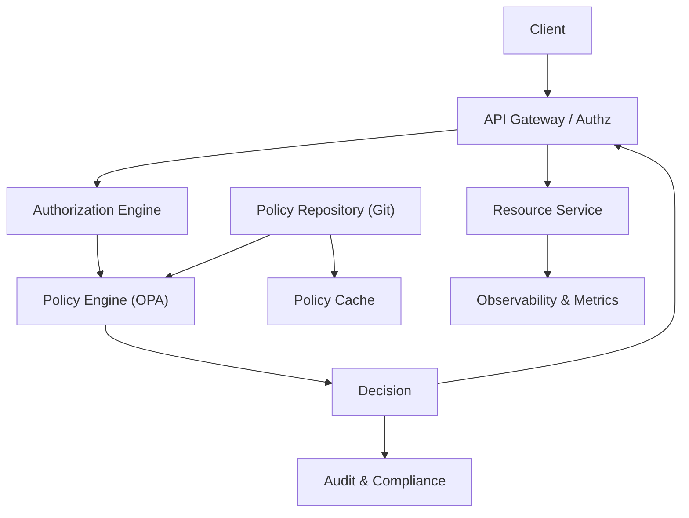

# Advanced Multi-Tenant IAM System with RBAC/ABAC and Policy-as-Code

Executive summary
- Objective: Build a scalable, multi-tenant IAM system that supports both RBAC and ABAC, powered by a policy-engine (policy-as-code) layer. The system evaluates access requests against dynamic policies, enforces decisions at runtime, and provides governance, auditing, and testability for security-critical environments.
- Why it’s advanced: combines role- and attribute-based access control with a centralized, versioned policy repository, a policy engine (e.g., OPA) for real-time evaluation, and testing/simulation tooling. Supports multi-tenancy, policy versioning, drift detection, and auditability.
- Core value: consistent, auditable access control across services and data stores, reduced custom authorization code, and a clear policy lifecycle that fits compliance needs.

Important notes and citations
- Policy engines and policy-as-code: Open Policy Agent (OPA) is a popular policy engine that enables ABAC/RBAC with policy-as-code using Rego. See the OPA docs: [Open Policy Agent](https://www.openpolicyagent.org/) and [Policy as Code with OPA](https://www.openpolicyagent.org/docs/latest/policy-as-code/). 
- ABAC vs RBAC concepts: ABAC and RBAC are formal access-control models. See NIST Glossary entries for RBAC and ABAC: [RBAC (NIST)](https://csrc.nist.gov/glossary/term/RBAC) and [ABAC (NIST)](https://csrc.nist.gov/glossary/term/ABAC).

Table of contents
1) Goals and scope
2) Architecture overview
3) Tech stack options
4) Data model (core entities and schemas)
5) Policy model (RBAC, ABAC) and policy-as-code
6) API surface (endpoints and payloads)
7) Policy lifecycle and governance
8) Security, compliance, and risk considerations
9) Observability, testing, and quality attributes
10) MVP plan, phased roadmap, and success criteria
11) Starter repository layout and starter artifacts
12) Example policies (Rego) and samples
13) Deployment and operations considerations
14) Optional extensions and future directions

15) Goals and scope
- Primary goal: Provide a low-friction, high-assurance authorization layer that can be embedded into multiple services (microservices, APIs, data services) with:
  - RBAC: role-based access scopes (roles defined per tenant)
  - ABAC: attribute-based access policies (subject, resource, action, environment attributes)
  - Policy-as-code: policies stored in a versioned repository, with canary promotions and auditability
  - Real-time evaluation: policy engine returns allow/deny decisions with explainability
  - Multi-tenancy: strict tenant isolation, per-tenant policy space, and scoped data access
  - Governance: policy versioning, testing, drift detection, and auditable logs
- Non-goals (for MVP): full UI for policy authoring (focus on API and programmatic policy management). UI can be added in a later phase.

2) Architecture overview
- High-level components:
  - API Gateway / Authz Layer: receives requests, normalizes input, performs initial authN, routes to policy evaluation
  - Policy Engine Service: evaluates requests against policies using Rego (OPA) or similar engine
  - Policy Store / Policy Repository: versioned policy definitions (Git-based) plus a cache
  - Resource/Subject Registry Service: stores user attributes, resource attributes, and access control metadata
  - Audit & Compliance Service: records all authorization decisions, inputs, and policy versions
  - Policy Simulation & Testing Service: runs policy tests and canaries against a test dataset
  - Telemetry & Observability: metrics, tracing, logs
- Data flows:
  - A client requests access (e.g., GET /api/resource/123). The API Gateway extracts subject, action, resource attributes and tenant. It calls the Policy Engine with a structured input. The policy engine evaluates the input against the tenant’s policies (RBAC/ABAC) and returns an allow/deny decision along with optional reasoning. The gateway either forwards the request to the resource service or returns 403 if denied. All decisions and inputs are logged for audit.
- Mermaid diagram (architecture):

3) Tech stack options
- Policy engine:
  - Open Policy Agent (OPA) with Rego policies (policy-as-code)
  - Alternatives: Casbin (RBAC/ABAC with policy adapters)
  - References: OPA docs for policy-as-code and evaluation: [Open Policy Agent](https://www.openpolicyagent.org/) and [Policy as Code with OPA](https://www.openpolicyagent.org/docs/latest/policy-as-code/).
- Identity and authN/O:
  - OIDC/OAuth2 provider (e.g., Auth0, Keycloak, AWS Cognito)
- Data stores:
  - PostgreSQL for subjects/resources metadata
  - Redis for caching policy decisions or policy results
  - Event bus (optional): Kafka or NATS for audit events
- Policy storage and governance:
  - Git-based policy repo (GitHub/GitLab) with semantic versioning
- APIs and services:
  - Microservice language choices: Go, TypeScript/Node.js, or Java
  - API gateway: NGINX/Envoy or a cloud-native gateway
- Observability:
  - OpenTelemetry for traces, metrics, and logs
  - Grafana for dashboards, Prometheus for metrics
- Security and compliance:
  - mTLS between services
  - Token scoping, least privilege policies

4) Data model (core entities and schemas)
- Tenants
  - id (UUID), name, region, policy_version
- Users (Subjects)
  - id (UUID), tenant_id (FK), username, attributes (JSONB, e.g., department, clearance, role, location)
- Resources
  - id (UUID), tenant_id (FK), type, attributes (JSONB, e.g., document_type, data_sensitivity, owner)
- Policies
  - id (UUID), tenant_id (FK), type = RBAC|ABAC, version, source (Git SHA or file path), created_at, updated_at
  - RBAC policy may map roles to resource types and actions
  - ABAC policy defines attribute rules for subject/resource/environment
- PolicyEvaluationInput (for policy engine)
  - tenant, subject (user attributes), resource attributes, action, environment, timestamp
- AccessDecision (result)
  - allowed (bool), reason (string), policy_version, evaluated_at
- AuditLog
  - id, tenant_id, user_id, resource_id, action, decision, policy_version, input, outcome, timestamp
- Schemas (example DDL snippets)
  - Users
    - id UUID PRIMARY KEY
    - tenant_id UUID REFERENCES tenants(id)
    - username TEXT UNIQUE
    - attributes JSONB
  - Resources
    - id UUID PRIMARY KEY
    - tenant_id UUID REFERENCES tenants(id)
    - type TEXT
    - attributes JSONB
  - Policies
    - id UUID PRIMARY KEY
    - tenant_id UUID REFERENCES tenants(id)
    - type TEXT CHECK (type in ('RBAC','ABAC'))
    - version INT
    - source TEXT
    - created_at TIMESTAMP
    - updated_at TIMESTAMP
  - AuditLog
    - id UUID PRIMARY KEY
    - tenant_id UUID
    - user_id UUID
    - resource_id UUID
    - action TEXT
    - decision BOOLEAN
    - policy_version INT
    - input JSONB
    - outcome TEXT
    - timestamp TIMESTAMP

5) Policy model (RBAC, ABAC) and policy-as-code
- RBAC model (example)
  - Roles per tenant
  - Each role defines allowed actions on resource types
  - Data shape (policy.json in tenant policy repo)
    - {
        "rbac": {
          "roles": {
            "admin": {
              "resources": {
                "document": ["read","write","delete"],
                "dataset": ["read","write"]
              }
            },
            "viewer": {
              "resources": {
                "document": ["read"],
                "dataset": ["read"]
              }
            }
          },
          "default_action": "deny"
        }
      }
- ABAC model (example)
  - Policies consider subject/resource/environment attributes
  - Data shape (policy.json)
    - {
        "abac": {
          "resources": {
            "document": {
              "attributes": {
                "department": ["finance","legal"],
                "sensitivity": ["low","medium","high"]
              },
              "actions": ["read","write"]
            }
          },
          "conditions": [
            "subject.department == resource.department",
            "subject.clearance >= resource.sensitivity"
          ]
        }
      }
- Policy-as-code approach
  - Store policies in a Git repo; each tenant has a policy set
  - Policies loaded by a Policy Engine Service (OPA or Casbin adapter)
  - Policy Engine evaluates input (tenant, subject, resource, action, environment) and returns allow/deny plus optional explanation
  - Supports policy versioning, canary deployments, and policy rollback
  - Testing and validation: policy unit tests, policy integration tests, and simulated policy runs in CI
- Rego policy examples (OPA)
  - RBAC (Rego)
    - package authz
      default allow = false
      allow {
        input.tenant == data.tenant
        role := input.subject.role
        policies := data.policies[input.tenant].rbac.roles[role]
        resource_type := input.resource.type
        allowed_actions := policies.resources[resource_type]
        some i
        allowed_actions[i] == input.action
      }
  - ABAC (Rego)
    - package authz
      default allow = false
      allow {
        input.tenant == data.tenant
        subject := input.subject
        resource := input.resource
        action := input.action
        // Base check: action allowed for resource type
        allowed_actions := data.policies[input.tenant].abac.resources[resource.type].actions
        some i
        allowed_actions[i] == action
        // Attribute-based conditions
        subject.department == resource.attributes.department
        subject.clearance >= resource.attributes.sensitivity
      }

6) API surface (endpoints and payloads)
- Core endpoints (examples; can be implemented as REST)
  - POST /api/v1/{tenant}/policies
    - Body: policy_type (RBAC|ABAC), version, policy_source (Git path or inline)
  - GET /api/v1/{tenant}/policies/{policy_id}
  - POST /api/v1/{tenant}/authorize
    - Body: { "subject": { "id": "...", "attributes": { ... } }, "resource": { "type": "...", "attributes": { ... } }, "action": "read", "environment": { ... } }
    - Response: { "allowed": true|false, "reason": "...", "policy_version": x, "evaluated_at": "..." }
  - GET /api/v1/{tenant}/audit/logs?limit=100&from=...
  - POST /api/v1/{tenant}/resources
  - POST /api/v1/{tenant}/subjects
- Sample authorization input
  - {
      "tenant": "tenantA",
      "subject": { "id": "user-123", "attributes": { "role": "admin", "department": "finance", "clearance": 5 } },
      "resource": { "type": "document", "attributes": { "department": "finance", "sensitivity": "high" } },
      "action": "write",
      "environment": { "ip": "10.0.0.15", "time": "2025-10-18T12:34:56Z" }
    }

7) Policy lifecycle, governance, and testing
- Policy lifecycle
  - Staging vs production: maintain separate policy branches per tenant
  - Versioning: semantic versioning for policy sets; policy_version field tracked in policy metadata
  - Canary deployments: evaluate new policies on a subset of requests or a limited tenant set before full rollout
  - Rollback: hot rollback to previous policy_version if issues detected
- Governance
  - Policy authorship: maintain policies in a policy repository with access control
  - Change control: PR reviews for policy changes; CI checks (linting, unit tests)
  - Observability: policy evaluation latency, decision distribution, audit trail completeness
- Testing approach
  - Policy unit tests: verify allow/deny for different input permutations
  - Integration tests: end-to-end authorization flow with real resources
  - Fuzz tests: stress test policy evaluation with unusual inputs
  - Drift checks: detect policy drift when policy source changes without expected outcomes

8) Security, compliance, and risk considerations
- Security design
  - Least privilege: policies define only necessary access
  - Strong identity: integrate with a robust IdP (OIDC/OAuth2)
  - Token-based access and scoping: ensure tokens carry tenant and role/attribute context
  - Policy integrity: sign policy changes, verify signatures in policy engine
  - Auditability: immutable logging of all decisions, inputs, policy_version, and outcomes
- Compliance considerations
  - Data residency and access controls per tenant
  - Data masking and privacy controls for sensitive attributes in logs
  - Regular security reviews and threat modeling for authorization paths
- Threat model considerations
  - Supply chain: ensure policy engine and policy sources are trusted
  - Injection: validate and sanitize policy inputs
  - Denial of service: rate-limit policy evaluations; cache decisions with TTL

9) Observability, testing, and quality attributes
- Metrics
  - Policy evaluation latency (ms)
  - Success rate of authorization decisions
  - Policy version adoption rate
  - Audit log throughput
- Tracing
  - End-to-end traces for authorization requests
- Logging
  - Structured logs with tenant_id, user_id, resource_id, action, decision, policy_version
- Testing
  - Automated policy unit tests, CI checks, end-to-end tests, fuzz tests
  - Canary test suite to validate new policies against production traffic

10) MVP plan, phased roadmap, and success criteria
- Phase 1: MVP core
  - RBAC+ABAC core with policy engine integration
  - Endpoints: authorize, manage subjects/resources, policy CRUD
  - Policy repo wired for canary-only changes
  - Logging and basic audit trail
  - Success criteria: < 50 ms policy evaluation latency under baseline load; 99.9% decision availability; auditable logs
- Phase 2: Policy-as-code optimization
  - Git-based policy repository with automated validation, linting, and tests
  - Canary and rollout tooling; policy versioning
  - Expose policy simulation endpoints
- Phase 3: Advanced governance
  - Drift detection, policy impact analysis, policy rollback tooling
  - UI for policy search and governance (optional)
- Phase 4: Compliance dashboards and reporting
  - Dashboards for audit logs, policy changes, and access patterns
- Success metrics
  - Latency targets (e.g., 20-100 ms latency on normal path)
  - Throughput goals (e.g., thousands of authorization decisions per second per cluster)
  - Audit completeness and policy-change traceability
  - Tenant isolation guarantees and data masking where needed

11) Starter repository layout and starter artifacts
- Suggested repo layout (monorepo or multi-repo)
  - authorization-service/
    - cmd/api-gateway/
    - pkg/authorization/ (policy evaluation, input normalization)
    - internal/policy/ (OPA integration, policy loading, cache)
    - internal/db/ (tenant, subjects, resources, policies)
    - internal/audit/ (logging and audit store)
    - tests/
  - policy-repo/ (Git-based, per-tenant policies; can be mirrored locally for CI)
  - policy-engine/
    - rego_policies/ (RBAC.rego, ABAC.rego, test.rego)
    - data/ (example data.json with sample policies)
  - docs/
  - deploy/
    - k8s/ (deploy manifests, Helm charts)
  - README with setup instructions and quickstart

12) Example policies (RegO) and samples
- RBAC RegO (simplified)
  - Data:
    - data.policies[tenant].rbac.roles.admin.resources.document = ["read","write","delete"]
    - data.policies[tenant].rbac.roles.viewer.resources.document = ["read"]
  - Rego:
    - package authz
      default allow = false
      allow {
        input.tenant == data.tenant
        role := input.subject.attributes.role
        resource_type := input.resource.type
        actions := data.policies[input.tenant].rbac.roles[role].resources[resource_type]
        some i
        actions[i] == input.action
      }
- ABAC RegO (simplified)
  - Data:
    - data.policies[tenant].abac.resources.document.attributes = { "department": ["finance","legal"], "sensitivity": ["low","medium","high"] }
  - Rego:
    - package authz
      default allow = false
      allow {
        input.tenant == data.tenant
        subject := input.subject
        resource := input.resource
        action := input.action
        some i
        allowed := data.policies[input.tenant].abac.resources[resource.type].actions
        allowed[i] == action
        subject.attributes.department == resource.attributes.department
        subject.attributes.clearance >= resource.attributes.sensitivity
      }

13) Deployment and operations considerations
- Deployment model
  - Microservice deployment (Kubernetes) with:
    - Policy Engine Service (OPA) as a sidecar or standalone service
    - Cache layer (Redis) for policy decisions
    - PostgreSQL for identity/resource/policy data
    - Git-based policy repo wired via webhook to auto-reload
- Security posture
  - mTLS between services
  - IdP integration for user attributes and authentication
  - Secrets management (external vault)
- Maintenance and scaling
  - Horizontal scaling for policy engine and audit service
  - Read replicas for policy data queries
  - Emulate tenant isolation in staging to mirror production

14) Optional extensions and future directions
- UI for policy authoring and governance (policy editor, policy tests, and drift dashboards)
- Fine-grained attribute sources (external identity attributes, device attributes, contextual attributes)
- Advanced policy features: temporal constraints, geo-location constraints, rate-limiting policies
- Compliance automation: auto-generation of audit reports for regulators
- Integration with cloud IAM offerings as a fallback or enrichment layer

